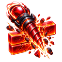

# Gatebreaker Arena v0.3 科技图标对照表

> 来源：`Gatebreaker Arena v0.3 科技清单.md`。共 60 项科技、44 个独立图标；每位英雄的核心科技在 P1–P5 共用同一个图标。

| 英雄 | 相位 | 科技 | 配置 ID | 图标 | 图标文件 | 效果描述 |
|---|---|---|---|---|---|---|
| 蜃影 | P1–P5 | 蜃核 | `TECH_MIRAGE_P1_BASE` `TECH_MIRAGE_P2_BASE` `TECH_MIRAGE_P3_BASE` `TECH_MIRAGE_P4_BASE` `TECH_MIRAGE_P5_BASE` |  | `mirage_core.png` | 增益【分形】+10%。 |
| 蜃影 | P1 | 蜂拥 | `TECH_MIRAGE_P1_SWARM` |  | `mirage_swarm.png` | 增益【分形】+50%，代价【缓滞】-40%。 |
| 蜃影 | P1 | 孤狼 | `TECH_MIRAGE_P1_LONEWOLF` |  | `mirage_lonewolf.png` | 增益【裂穿】+40%，代价【分形】-30%。 |
| 蜃影 | P2 | 裂变 | `TECH_MIRAGE_P2_FISSION` |  | `mirage_fission.png` | 增益【分形】+40%，代价【疾风】-45%。 |
| 蜃影 | P2 | 洪流 | `TECH_MIRAGE_P2_FLOOD` |  | `mirage_flood.png` | 增益【分形】+60%，代价【广域】-75%。 |
| 蜃影 | P3 | 增殖 | `TECH_MIRAGE_P3_PROLIFERATE` |  | `mirage_proliferate.png` | 增益【分形】+40%，代价【裂穿】-30%。 |
| 蜃影 | P3 | 吞噬 | `TECH_MIRAGE_P3_DEVOUR` |  | `mirage_devour.png` | 增益【缓滞】+30%，代价【分形】-20%。 |
| 蜃影 | P4 | 虫群 | `TECH_MIRAGE_P4_HIVE` |  | `mirage_hive.png` | 增益【分形】+50%，代价【磁吸】-120%。机制：生成 1 颗永久副球，速度为主球 90%。 |
| 蜃影 | P4 | 归巢 | `TECH_MIRAGE_P4_HOMECOMING` |  | `mirage_homecoming.png` | 增益【广域】+45%，代价【疾风】-30%。机制：临时球持续时间 +2s；断连时连击清零惩罚翻倍。 |
| 蜃影 | P5 | 满巢 | `TECH_MIRAGE_P5_FULLNEST` |  | `mirage_fullnest.png` | 增益【分形】+60%，代价【缓滞】-50%。 |
| 蜃影 | P5 | 星爆 | `TECH_MIRAGE_P5_STARBURST` |  | `mirage_starburst.png` | 增益【裂穿】+50%，代价【分形】-40%。 |
| 脉冲 | P1–P5 | 脉核 | `TECH_PULSE_P1_BASE` `TECH_PULSE_P2_BASE` `TECH_PULSE_P3_BASE` `TECH_PULSE_P4_BASE` `TECH_PULSE_P5_BASE` |  | `pulse_core.png` | 增益【疾风】+15%。 |
| 脉冲 | P1 | 疾走 | `TECH_PULSE_P1_SPRINT` |  | `pulse_sprint.png` | 增益【疾风】+45%，代价【缓滞】-20%。 |
| 脉冲 | P1 | 穿刺 | `TECH_PULSE_P1_PIERCE` |  | `pulse_pierce.png` | 增益【裂穿】+40%，代价【疾风】-45%。 |
| 脉冲 | P2 | 超频 | `TECH_PULSE_P2_OVERCLOCK` |  | `pulse_overclock.png` | 增益【疾风】+60%，代价【广域】-45%。 |
| 脉冲 | P2 | 破甲 | `TECH_PULSE_P2_ARMORBREAK` |  | `pulse_armorbreak.png` | 增益【裂穿】+40%，代价【分形】-30%。 |
| 脉冲 | P3 | 红线 | `TECH_PULSE_P3_REDLINE` |  | `pulse_redline.png` | 增益【疾风】+45%，代价【缓滞】-20%。 |
| 脉冲 | P3 | 凝滞 | `TECH_PULSE_P3_STASIS` |  | `pulse_stasis.png` | 增益【缓滞】+30%，代价【疾风】-30%。 |
| 脉冲 | P4 | 极速 | `TECH_PULSE_P4_MAXSPEED` |  | `pulse_maxspeed.png` | 增益【疾风】+60%，代价【广域】-45%。机制：节拍上限提高到 7；节拍清零时速度瞬间 -15%，持续 0.5s。 |
| 脉冲 | P4 | 制动 | `TECH_PULSE_P4_BRAKE` |  | `pulse_brake.png` | 增益【广域】+45%，代价【疾风】-30%。机制：节拍上限保持 5；挡板边缘击球附带 0.3s 减速瞄准，随后加速。 |
| 脉冲 | P5 | 暴走 | `TECH_PULSE_P5_RAMPAGE` |  | `pulse_rampage.png` | 增益【疾风】+75%，代价【缓滞】-40%。 |
| 脉冲 | P5 | 穿云 | `TECH_PULSE_P5_CLOUDPIERCE` |  | `pulse_cloudpierce.png` | 增益【裂穿】+50%，代价【疾风】-60%。 |
| 裂痕 | P1–P5 | 裂核 | `TECH_RIFT_P1_BASE` `TECH_RIFT_P2_BASE` `TECH_RIFT_P3_BASE` `TECH_RIFT_P4_BASE` `TECH_RIFT_P5_BASE` |  | `rift_core.png` | 增益【裂穿】+10%。 |
| 裂痕 | P1 | 深钻 | `TECH_RIFT_P1_DEEPDRILL` |  | `rift_deepdrill.png` | 增益【裂穿】+50%，代价【分形】-40%。 |
| 裂痕 | P1 | 稳盘 | `TECH_RIFT_P1_STEADY` |  | `rift_steady.png` | 增益【广域】+45%，代价【磁吸】-60%。 |
| 裂痕 | P2 | 贯穿 | `TECH_RIFT_P2_PENETRATE` |  | `rift_penetrate.png` | 增益【裂穿】+60%，代价【疾风】-75%。 |
| 裂痕 | P2 | 破阵 | `TECH_RIFT_P2_BREAKARRAY` |  | `rift_breakarray.png` | 增益【裂穿】+40%，代价【分形】-30%。 |
| 裂痕 | P3 | 贯星 | `TECH_RIFT_P3_STARPIERCE` |  | `rift_starpierce.png` | 增益【裂穿】+50%，代价【广域】-60%。 |
| 裂痕 | P3 | 凝壁 | `TECH_RIFT_P3_WALLSTAB` |  | `rift_wallstab.png` | 增益【缓滞】+30%，代价【裂穿】-20%。 |
| 裂痕 | P4 | 钻地 | `TECH_RIFT_P4_DRILLDOWN` |  | `rift_drilldown.png` | 增益【裂穿】+60%，代价【分形】-50%。机制：穿透同一列连穿 2 块返还 1 次穿透，每次技能最多返还 2 次。 |
| 裂痕 | P4 | 广域 | `TECH_RIFT_P4_WIDEFIELD` |  | `rift_widefield.png` | 增益【广域】+45%，代价【疾风】-30%。机制：穿透结束时对左右相邻砖各造成 1 点伤害。 |
| 裂痕 | P5 | 无界 | `TECH_RIFT_P5_BOUNDLESS` |  | `rift_boundless.png` | 增益【裂穿】+70%，代价【缓滞】-60%。 |
| 裂痕 | P5 | 碎星 | `TECH_RIFT_P5_STARCHATTER` |  | `rift_starchatter.png` | 增益【裂穿】+50%，代价【磁吸】-120%。 |
| 折光 | P1–P5 | 折核 | `TECH_REFRACT_P1_BASE` `TECH_REFRACT_P2_BASE` `TECH_REFRACT_P3_BASE` `TECH_REFRACT_P4_BASE` `TECH_REFRACT_P5_BASE` |  | `refract_core.png` | 增益【广域】+15%。 |
| 折光 | P1 | 稳镜 | `TECH_REFRACT_P1_STEADYMIRROR` |  | `refract_steadymirror.png` | 增益【广域】+45%，代价【疾风】-30%。 |
| 折光 | P1 | 吸星 | `TECH_REFRACT_P1_MAGNETSTAR` |  | `refract_magnetstar.png` | 增益【磁吸】+60%，代价【分形】-10%。 |
| 折光 | P2 | 扩域 | `TECH_REFRACT_P2_EXPANDFIELD` |  | `refract_expandfield.png` | 增益【广域】+60%，代价【分形】-30%。 |
| 折光 | P2 | 校准 | `TECH_REFRACT_P2_CALIBRATE` |  | `refract_calibrate.png` | 增益【磁吸】+90%，代价【疾风】-30%。 |
| 折光 | P3 | 回廊 | `TECH_REFRACT_P3_CORRIDOR` |  | `refract_corridor.png` | 增益【广域】+45%，代价【裂穿】-20%。 |
| 折光 | P3 | 分光 | `TECH_REFRACT_P3_SPLITLIGHT` |  | `refract_splitlight.png` | 增益【分形】+30%，代价【广域】-30%。 |
| 折光 | P4 | 无限 | `TECH_REFRACT_P4_INFINITE` |  | `refract_infinite.png` | 增益【广域】+60%，代价【疾风】-45%。机制：镜面期间主球与镜面碰撞 3 次，每次速度 +5%，总计 ≤15%。 |
| 折光 | P4 | 引力 | `TECH_REFRACT_P4_GRAVITY` |  | `refract_gravity.png` | 增益【磁吸】+120%，代价【分形】-30%。机制：主球首次碰镜面生成 1 颗持续 5s 的临时球。 |
| 折光 | P5 | 全境 | `TECH_REFRACT_P5_FULLDOMAIN` |  | `refract_fulldomain.png` | 增益【广域】+75%，代价【缓滞】-40%。 |
| 折光 | P5 | 归流 | `TECH_REFRACT_P5_RETURNFLOW` |  | `refract_returnflow.png` | 增益【磁吸】+150%，代价【疾风】-60%。 |
