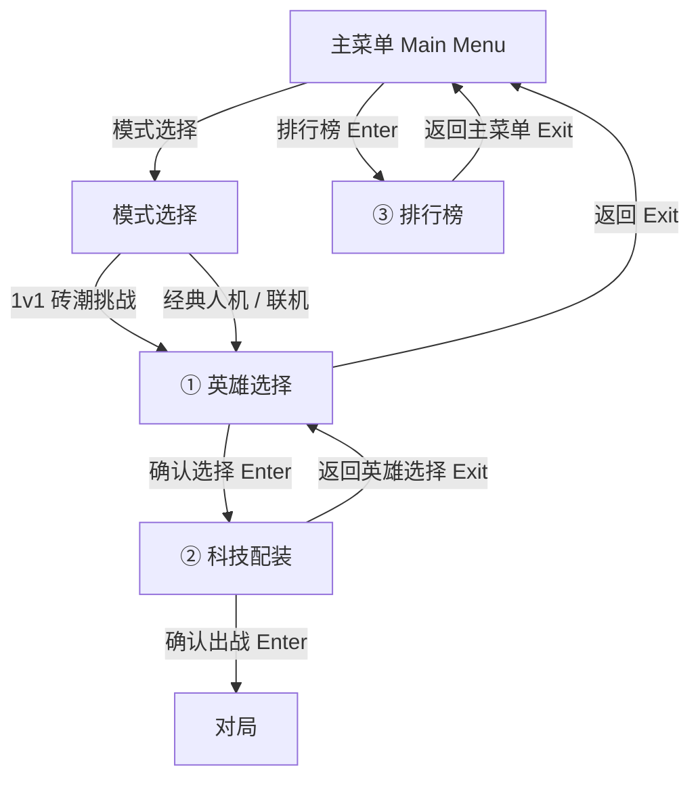
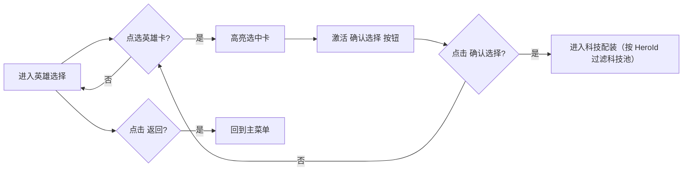
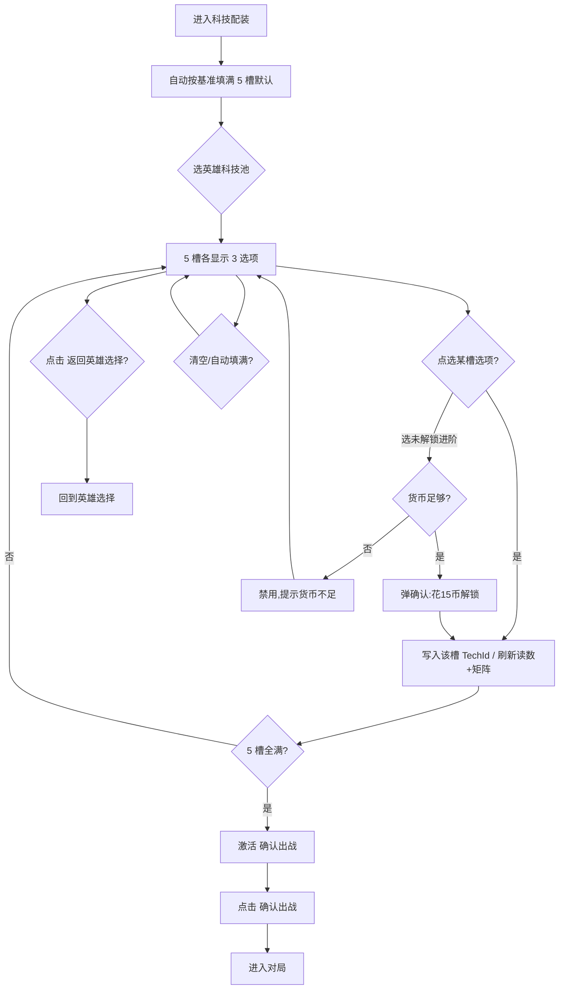
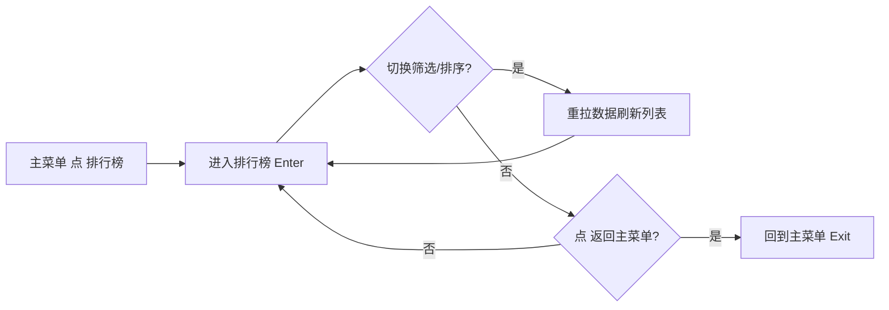

# Gatebreaker Arena v0.3 界面 UX 规格 v0.2

> **版本**：v0.2
> **日期**：2026-08-22
> **作者**：ui-ux-designer
> **范围**：3 个战前/菜单界面 —— ① 英雄选择 ② 科技配装（战前预设）③ 排行榜
> **状态**：v0.2，已据用户裁定 4 项（Q1/Q4/Q7/Q9）+ Q2 闭环定稿；待视觉规格对齐后出可交互原型
> **依赖文档**：
> - 《Gatebreaker Arena 1v1 双向砖潮 相位成长与英雄科技设计 v0.3》（内容权威来源）
> - 《Gatebreaker Arena 1v1 双向砖潮 v0.3 UI 补充计划 v0.1》（界面清单与架构雷区）
> - 《Gatebreaker Arena 字体与 TMP 方案 v0.1》（字体角色）
> - 《Gatebreaker v0.3 UI 参考原型.html》（最新低保真交互原型，视觉与布局基准）
> - 规则配置草稿 v0.3.json（`DT_PhaseHero` / `DT_PhaseTech` / `DT_PhaseMeta` / `DT_PhaseItem` 字段名来源）

---

## 0. 摘要（给 team-lead 一页纸）

本规格为 v0.3 三个战前/菜单界面给出可直接转视觉与实现的信息架构、用户流、内容清单、Enter/Exit 按钮、交互状态与可访问性要求。

- **英雄选择**：4 张相位英雄卡（蜃影/脉冲/裂痕/折光），展示维度（成长定位）、核心资源、核心道具、P1~P5 概述；选中后显式「确认选择 → 科技配装」。
- **科技配装**：5 个相位槽（P1~P5）× 3 科技选项（1 默认 + 2 进阶），每科技展示成对「增益/削弱」；净偏移按**每槽预算 +30**（守恒：每张科技净偏移恒为 +30）；附实时价值矩阵聚合；**进入时按基准自动填满 5 槽默认科技，「确认出战」始终可点，可 [清空] 后手动替换为进阶**。
- **排行榜**：排名列表（名次/玩家名/ELO 或 胜分/胜率/地区/主英雄），本地玩家行高亮；**数据现为本地占位 stub**；「返回主菜单」。

**关键对齐结论（已与参考原型一致）**：

1. P4 协议已并入 P4 进阶科技的「机制强化」文本，英雄选择/配装不再有独立协议选择器（JSON 中 `ProtocolOptions` 已闭环，统一以 P4 进阶科技文案承载，见 §8-Q2）。
2. 净偏移为**每槽预算 +30**，每张科技净偏移恒 = +30（守恒，**数据权威口径**）；不存在 UI 补充计划 §3 所述「Σ≤30 硬上限」；「当前合计」= 已选槽数 ×30，仅作平衡读数。
3. 进阶科技需货币解锁（单价 15，见 `META.TechUnlockCost`），未解锁显示锁定态与花费；点选时内联解锁（弹确认扣币）。
4. Enter 采用「选中 + 显式确认」两步，而非点卡即跳，以支持键盘/手柄与撤销。

**本版（v0.2）用户裁定**：

- **Q1 净偏移**：采纳「每槽 +30 守恒」口径（数据权威），删去与 UI 补充计划 Σ≤30 冲突的描述（见 §4.5）。
- **Q2 P4 协议**：已闭环，合并进 P4 进阶科技（机制强化）。
- **Q4 排行榜**：本地占位 stub（Mock 假数据），字段沿用 §5.3 schema；文档注明「占位数据，后端就绪替换」。
- **Q7 英雄选择 Exit**：直接回主菜单（非模式选择）。
- **Q9 科技配装默认**：进入时按基准自动填满（5 槽默认科技），确认永远可点；保留 [清空] 与手动替换进阶。
- **Q3 / Q5 / Q6 / Q8** 维持 v0.1 推荐态（选中+显式确认 / 掉率偏移不启用 / 进阶内联解锁 / 含移动端响应式）。

---

## 1. 设计依据与视觉语言

### 1.1 视觉方向（来自两张截图描述 + 参考原型）

暗色太空霓虹（dark space neon）：深空底 + 六边形竞技场母题 + 蓝/青发光边框 + 居中面板 + 像素/科技字体。参考原型用更克制的暗色面板语言（`--bg #0e1116`），本规格沿用其 token 并叠加六边形装饰边框以贴合截图母题。

### 1.2 色彩 Token（与参考原型 CSS 变量对齐）

| Token | 值 | 用途 |
|---|---|---|
| `--bg` | `#0e1116` | 深空背景 |
| `--panel` | `#171c24` | 一级面板 |
| `--panel2` | `#1f2630` | 二级面板 / 槽 / 选项 |
| `--line` | `#2b3440` | 边框 / 分隔线 |
| `--txt` | `#e6edf3` | 主文字 |
| `--sub` | `#8b98a5` | 次要文字（对照 `--bg` 约 7:1，达 WCAG AA） |
| `--accent` | `#4cc2ff` | 主强调（青）/ 选中 / 发光边框 |
| `--good` | `#46d18a` | 增益 / 正向 |
| `--bad` | `#ff6b6b` | 削弱 / 负向 / 错误 |
| `--warn` | `#ffb454` | 警示 / 阈值刻度 |

**发光规则**：选中态与一级强调面板用 `box-shadow: 0 0 0 1px var(--accent), 0 0 12px rgba(76,194,255,.35)`；六边形装饰边框作低不透明度背景，不得降低文字对比度。

### 1.3 字体角色（来自字体方案 v0.1）

| 角色 | 字体 | 本规格用途 |
|---|---|---|
| `ArcadeTitle` | Press Start 2P | 英文街机大标题（如 `PHASE HEROES`、`TECH LOADOUT`），仅短词 |
| `PixelChinese` | Fusion Pixel 12px zh_hans | 中文标题、按钮、提示、列表正文 |
| `PixelBody` | Pixelify Sans | 玩家名、数字、ELO、百分比 |
| `Fallback` | Fusion Pixel 12px | 中文缺字兜底 |

约束：Press Start 2P 仅在 ≥16px 英文短词使用；中文最小 12px；UI 只承载表现与输入转发，不写玩法规则。

### 1.4 布局与母题

- 桌面横屏为主；移动端纵屏用响应式栅格（参考原型 `@media(max-width:880px)` 折为单列）。
- 英雄选择与科技配装可叠加六边形竞技场边框母题；排行榜用更中性的列表布局。
- 所有面板居中、圆角 12px、1px `--line` 边框；强调面板加青色发光。

---

## 2. 全局导航与信息架构



**三屏定位**

| 屏幕 | 时机 | 数据来源 | Enter 去向 | Exit 去向 |
|---|---|---|---|---|
| 英雄选择 | 战前 | `DT_PhaseHero` | 科技配装 | 主菜单 |
| 科技配装 | 战前 | `DT_PhaseTech` / `DT_PhaseMeta` / `DT_PhaseItem` | 对局 | 英雄选择 |
| 排行榜 | 菜单 | 本地占位 stub（Mock），见 §8-Q4 / §5 | — | 主菜单 |

---

## 3. 屏幕一：英雄选择（Hero Select）

> 替换 V1 英雄卡组选择；只呈现 4 相位英雄，弃用芯片卡组/路径/签名芯片。

### 3.1 信息架构

```
英雄选择
├── 标题区：相位英雄选择 / PHASE HEROES
├── 英雄卡网格（4 张，等比）
│   └─ 每张卡：
│      ├─ 英雄名（中文 + 英文代号）
│      ├─ 维度 / 成长定位（数量/速度/穿透/弹道）
│      ├─ 核心资源（连击/节拍/裂口/折射标记）
│      ├─ 核心道具（分形/疾风/裂穿/广域）
│      └─ P1~P5 相位概述（可折叠）
│         ├─ 相位 + Φ 阈值
│         ├─ 性质（身份/量变/主动/协议/收束）
│         └─ 效果文本
├── 提示条：P4 协议已并入 P4 进阶科技（机制强化）
└── 底部操作条：
    ├─ [返回]（Exit → 主菜单）
    └─ [确认选择 → 科技配装]（Enter，选中后激活）
```

### 3.2 用户流



### 3.3 内容清单（数据字段）

| 字段 | 来源 | 示例 | 说明 |
|---|---|---|---|
| 英雄名 `DisplayName` | `DT_PhaseHero.DisplayName` | 蜃影 | 中文主名 |
| 英文代号 | 设计文档命名 | Shadow | 副标题（`ArcadeTitle` 风格可不用） |
| 维度 `Dimension` | `DT_PhaseHero.Dimension` | 数量 | 即成长定位，作标签 |
| 核心资源 `CoreResource` | `DT_PhaseHero.CoreResource` | Combo→连击 | 显示中文友好名 |
| 核心道具 `CoreItem` | `DT_PhaseHero.CoreItem` | 分形 | 英文 ID 转中文名 |
| 相位 `PhaseLevels[].PhaseLevel` | JSON | P1~P5 | 5 级 |
| 性质 `Nature` | JSON | Identity→身份 | 中英映射 |
| Φ 阈值 `PhiToReach` | JSON | 0/30/50/70/100 | 升阶所需 Φ |
| 效果文本 `EffectText` | JSON | 连击达 8 时分裂… | 直接展示 |
| 主动技能 `ActiveAbility` | JSON（P3） | 冷却 12s | P3 卡内显示冷却 |
| 协议 `ProtocolOptions` | JSON（P4） | 镜影/潮汐 | **已并入 P4 进阶科技（机制强化），见 §8-Q2** |

4 英雄速查：

| 英雄 | 代号 | 维度（成长定位） | 核心资源 | 核心道具 |
|---|---|---|---|---|
| 蜃影 | Shadow | 数量（一片命中） | 连击 Combo | 分形 |
| 脉冲 | Pulse | 速度（节拍加速） | 节拍 Tempo | 疾风 |
| 裂痕 | Rift | 穿透（单球打穿） | 裂口 Rift | 裂穿 |
| 折光 | Prism | 弹道（改变球路） | 折射标记 RefractMark | 广域 |

### 3.4 Enter / Exit 按钮

| 按钮 | 文案 | 位置 | 行为 | 启用条件 |
|---|---|---|---|---|
| **Enter** | 确认选择 → 科技配装 | 底部操作条右侧（主按钮，青色发光） | 写入 `PhaseMatchLoadout.HeroId`，进入科技配装 | 已选中 1 张英雄卡 |
| **Exit** | 返回 | 底部操作条左侧（幽灵按钮） | 回到主菜单 | 始终可用 |

> Enter 采用「选中 + 显式确认」两步，而非点卡即跳，以支持键盘/手柄与撤销。

### 3.5 交互状态

| 状态 | 表现 |
|---|---|
| 默认 | 卡片 1px `--line` 边框，居中面板 |
| Hover | 边框变 `--accent`，轻微上浮（≤2px） |
| 选中（Selected） | 边框 `--accent` + 青色发光 + 角标「已选」 |
| 聚焦（键盘） | 可见焦点环（accent 光晕），与 hover 区分 |
| 禁用（Enter） | 未选中时按钮置灰、不可点，提示「请选择一个英雄」 |

### 3.6 布局草图（ASCII 低保真）

```
┌──────────────────────────────────────────────────────────────┐
│ 相位英雄选择  PHASE HEROES                                     │
├──────────┬──────────┬──────────┬───────────────────────────────┤
│ 蜃影      │ 脉冲      │ 裂痕      │ 折光                        │
│ Shadow    │ Pulse    │ Rift     │ Prism                       │
│ 维度·数量  │ 维度·速度  │ 维度·穿透  │ 维度·弹道                   │
│ 核心:连击  │ 核心:节拍  │ 核心:裂口  │ 核心:折射标记               │
│ 道具:分形  │ 道具:疾风  │ 道具:裂穿  │ 道具:广域                   │
│ ──────── │ ──────── │ ──────── │ ────────                    │
│ P1 身份   │ P1 身份   │ P1 身份   │ P1 身份                      │
│ P2 量变   │ P2 量变   │ P2 量变   │ P2 量变                      │
│ P3 主动   │ P3 主动   │ P3 主动   │ P3 主动                      │
│ P4 协议   │ P4 协议   │ P4 协议   │ P4 协议                      │
│ P5 收束   │ P5 收束   │ P5 收束   │ P5 收束                      │
│  [已选]★ │          │          │                              │
├──────────┴──────────┴──────────┴───────────────────────────────┤
│ P4 协议已并入 P4 进阶科技（机制强化）展示                        │
│ [返回]                              [确认选择 → 科技配装]        │
└──────────────────────────────────────────────────────────────┘
```

---

## 4. 屏幕二：科技配装（Tech Loadout / 战前预设）

> 进对局前配好科技 loadout；局内只展示不抽取。每英雄 15 科技（5 槽 ×3）。

### 4.1 信息架构

```
科技配装（标题含已选英雄名）
├── 顶部读数条
│   ├─ 净偏移预算/槽：+30
│   ├─ 已选槽：N / 5
│   ├─ 净偏移合计：+{N×30}
│   ├─ 可用货币：X 币
│   ├─ [按基准自动填满]  [清空]
├── 5 个相位槽（P1~P5，竖向或 2 列栅格）
│   └─ 每槽：
│      ├─ 槽头：相位 + Φ阈值 + 当前净偏移徽标(+30)
│      └─ 3 个科技选项（Default + 2 Advanced）
│         ├─ 科技名 + ◆(进阶标记)
│         ├─ 花费（进阶且未解锁：15 币 + 🔒）
│         ├─ 成对增益/削弱（色码：绿增益/红削弱）
│         └─ 机制强化文本（仅 P4 进阶）
├── 价值矩阵（实时聚合）
│   └─ 6 道具 × 价值权重 × 增益合计 × 削弱合计 × 净
└── 底部操作条
    ├─ [返回英雄选择]（Exit）
    └─ [确认出战 → 进入对局]（Enter，主按钮）
```

> 进入本屏时按基准自动填满 5 槽默认科技，「确认出战」始终可点；玩家可 [清空] 后手动替换为进阶科技（Q9 裁定）。

### 4.2 用户流



### 4.3 内容清单（数据字段）

**读数条**

| 字段 | 来源 | 示例 |
|---|---|---|
| 净偏移预算/槽 | `META.NetOffsetBudget` | +30 |
| 已选槽 | 本地状态 | 5 / 5（进入即默认填满） |
| 净偏移合计 | Σ 已选 `NetOffset` | +150（=5×30，进入默认） |
| 可用货币 | 玩家存档 | 1250 币 |
| 掉率偏移上限（可选展示） | `META.DropOffsetCap` | +10（当前数据未启用，见 §8-Q5） |

**科技选项（来自 `DT_PhaseTech`，按 `HeroId`+`SlotPhase` 过滤）**

| 字段 | 来源 | 示例 |
|---|---|---|
| 科技名 `DisplayName` | JSON | 蜂拥 |
| 类型 `Kind` | JSON | Default / Advanced（◆ 标记） |
| 花费 `CostCurrency` | JSON | 0（默认）/ 15（进阶） |
| 净偏移 `NetOffset` | JSON | 30（恒值，守恒） |
| 效果 `Effects[]` | JSON | `{ItemName:分形, Op:Enhance, Mag:50}`、`{ItemName:缓滞, Op:Weaken, Mag:40}` |
| 机制强化（P4 进阶） | 参考原型 `mech` 字段 | 生成 1 颗永久副球…（P4 协议已闭环并入，见 §8-Q2） |

**价值矩阵（实时聚合，来自 `DT_PhaseItem`）**

| 道具 | 价值权重 `ValueWeight` | 增益合计 | 削弱合计 | 净 |
|---|---|---|---|---|
| 裂穿 | 3 | +0% | −30% | −30% |
| 分形 | 3 | +50% | −0% | +50% |
| 缓滞 | 3 | +0% | −40% | −40% |
| 疾风 | 2 | +0% | −0% | 0% |
| 广域 | 2 | +0% | −0% | 0% |
| 磁吸 | 1 | +0% | −0% | 0% |

> 矩阵即局内「科技装载条」所展示的内容，让玩家在战前看清「爱哪些/躲哪些」道具。

### 4.4 Enter / Exit 按钮

| 按钮 | 文案 | 位置 | 行为 | 启用条件 |
|---|---|---|---|---|
| **Enter** | 确认出战 → 进入对局 | 底部右侧（主按钮） | 组装 `PhaseMatchLoadout{HeroId, TechIds[5]}` 进入对局 | 默认进入即 5 槽全满（可点）；[清空] 后需重填或自动填满方可 |
| **Exit** | 返回英雄选择 | 底部左侧（幽灵） | 回到英雄选择（保留已选，待确认） | 始终可用 |
| 辅助 | 按基准自动填满 | 顶部读数条 | 5 槽填默认科技（免费、恒可用） | 已选英雄 |
| 辅助 | 清空 | 顶部读数条 | 清空所有槽选择 | 有选择时 |

### 4.5 交互状态

| 状态 | 表现 |
|---|---|
| 默认选项 | `--panel2` 底，1px `--line` 边框 |
| Hover | 边框 `--accent` |
| 选中（Selected） | 边框 `--accent` + 发光 + 左侧色条 |
| 锁定未解锁（Locked） | 半透明 + 🔒 + 花费标签；点选触发解锁确认弹窗（货币足够）或置灰（不足） |
| 不可负担（Cannot afford） | 锁定态 + 花费标红 + 提示「货币不足，需 X 币」 |
| 错误/非法 | 「确认出战」置灰；槽头显示「未选」红点；读数条提示缺槽数（仅 [清空] 后可能出现） |
| 聚焦（键盘） | 可见焦点环 |

**净偏移读数语义（数据权威口径）**：每槽徽标恒显 +30（守恒保证，每张科技 `NetOffset` 恒 = +30）；合计 = 已选槽×30，仅作平衡读数，**无 Σ≤30 硬上限**——UI 补充计划 §3「Σ 不得超过 30，超限禁止确认」以本口径为准。

### 4.6 布局草图（ASCII 低保真，进入即默认填满）

```
┌──────────────────────────────────────────────────────────────┐
│ 科技配装 · 蜃影 Shadow           净偏移预算/槽 +30  已选 5/5    │
│ 净偏移合计 +150  可用 1250 币   [按基准自动填满] [清空]        │
├──────────────────────────────┬───────────────────────────────┤
│ P1 · Φ0   净偏移 +30           │ P4 · Φ70  净偏移 +30          │
│ ● 基准 分形+10%（默认）        │ ● 基准 分形+10%（默认）        │
│ ◆ 蜂拥 增益分形+50% 削弱缓滞   │ ◆ 虫群 增益分形+50% 削弱磁吸  │
│   −40%  (15币🔒)               │   −120% 机制:永久副球(15币🔒) │
│ ◆ 孤狼 增益裂穿+40% 削弱分形   │ ◆ 归巢 增益广域+45% 削弱疾风  │
│   −30%  (15币🔒)               │   −30%  (15币🔒)              │
├──────────────────────────────┴───────────────────────────────┤
│ 道具价值矩阵（实时聚合）                                        │
│ 道具  权重  增益   削弱   净                                    │
│ 分形    3   +50%    0%   +50%                                  │
│ 缓滞    3     0%  −40%   −40%                                  │
├──────────────────────────────────────────────────────────────┤
│ [返回英雄选择]                    [确认出战 → 进入对局]         │
└──────────────────────────────────────────────────────────────┘
```

---

## 5. 屏幕三：排行榜（Leaderboard）

> 参考原型未含此屏；以下为新建设计，沿用同套视觉语言。**数据来源为本地占位 stub（Mock 假数据）**，字段沿用 §5.3 schema；**占位数据，后端就绪替换**。

### 5.1 信息架构

```
排行榜 LEADERBOARD
├── 筛选/标签栏
│   ├─ 模式：1v1 砖潮 / 联机
│   ├─ 范围：全球 / 本区 / 好友
│   └─ 排序：ELO ↓ / 胜率 ↓
├── 列表头：名次 | 玩家 | ELO/胜分 | 胜率(W-L) | 地区 | 主英雄
├── 列表行（前 N 名，N=50 或分页）
│   └─ 每行：名次徽标(前三金银铜发光) | 名 | 分 | 胜率 | 地区旗 | 主英雄
├── 本地玩家行（若不在前 N，固定钉在列表底部「你的排名 #X」）
└── 底部操作条
    └─ [返回主菜单]（Exit）
```

> 列表数据为**本地占位 stub（Mock 假数据）**，字段沿用 §5.3；后端就绪后替换，UI 不变。

### 5.2 用户流



### 5.3 内容清单（数据字段，本地 Mock stub 占位；字段沿用本表 schema，后端就绪替换）

| 字段 | 类型 | 说明 |
|---|---|---|
| 名次 `Rank` | int | 当前筛选/排序下的排名 |
| 玩家名 `PlayerName` | string | 显示名（PixelBody） |
| ELO / 胜分 `Score` | int | 排位分；或用「胜分」(货币外另计) |
| 胜率 `WinRate` | % | 附 W-L 记录（如 142-98） |
| 地区 `Region` | enum | 全球/本区/好友范围下的地区标签 |
| 主英雄 `MainHero` | enum | 蜃影/脉冲/裂痕/折光（图标） |
| 是否本地玩家 `IsSelf` | bool | 高亮行 |

### 5.4 Enter / Exit 按钮

| 按钮 | 文案 | 位置 | 行为 | 启用条件 |
|---|---|---|---|---|
| **Enter** | （由主菜单「排行榜」进入，无屏内 Enter） | — | 进入本屏即完成进入 | — |
| **Exit** | 返回主菜单 | 底部（幽灵） | 回到主菜单 | 始终可用 |

> 因排行榜从主菜单单向进入，屏内不设 Enter；Exit 即「返回主菜单」。若未来需从对局结算跳转，可加「查看排行榜」入口复用本屏。

### 5.5 交互状态

| 状态 | 表现 |
|---|---|
| 默认行 | 列表行，hover 高亮背景 |
| 本地玩家行 | accent 左边框 + 轻微发光 + 「你」标签 |
| 前三名 | 名次徽标金银铜发光（金 #ffd166 / 银 #c0c7d1 / 铜 #cd7f32 近似） |
| 聚焦 | 行级焦点环（键盘可达） |
| 加载中 | 骨架屏 / 转圈，列表占位 |
| 空数据 | 「暂无数据」+ 重试按钮 |
| 错误 | 顶部红条「排行榜暂时不可用」，保留返回 |

### 5.6 布局草图（ASCII 低保真，占位数据示意）

```
┌──────────────────────────────────────────────────────────────┐
│ 排行榜  LEADERBOARD  （占位数据 · Mock）                        │
│ 模式[1v1砖潮▼]  范围[全球▼]  排序[ELO▼]                        │
├──────┬──────────┬────────┬──────────┬────────┬───────────────┤
│ 名次 │ 玩家     │ ELO    │ 胜率      │ 地区   │ 主英雄        │
├──────┼──────────┼────────┼──────────┼────────┼───────────────┤
│ 🥇1  │ Nova     │ 2140   │ 71% 142-98│ 华东   │ 蜃影          │
│ 🥈2  │ Kai      │ 2088   │ 68% 130-61│ 华北   │ 裂痕          │
│ 🥉3  │ Rei      │ 2012   │ 66% 99-51 │ 华南   │ 折光          │
│  4   │ ...      │ ...    │ ...       │ ...    │ ...           │
│ ...  │          │        │           │        │               │
├──────┴──────────┴────────┴──────────┴────────┴───────────────┤
│ ▍你  排名 #37  ELO 1540  胜率 54% 73-62  主英雄 脉冲           │
│ [返回主菜单]                                                  │
└──────────────────────────────────────────────────────────────┘
```

---

## 6. 跨屏一致性 / 复用组件

| 组件 | 复用屏 | 规范 |
|---|---|---|
| `HeroCard` | 英雄选择 | 4 卡等比；含名/维度/核心资源/核心道具/P1~P5 概述；选中发光 |
| `TechOption` | 科技配装 | 名+◆+花费+成对增益/削弱+机制文本；4 态（默认/hover/选中/锁定） |
| `NetOffsetBadge` | 科技配装 | 恒显 `+30`，accent 小药丸 |
| `ValueMatrix` | 科技配装 | 6 行聚合，绿增益/红削弱/净色码 |
| `RankedRow` | 排行榜 | 名次/名/分/胜率/地区/主英雄；前三金银铜；本地高亮 |
| `Button` 体系 | 全部 | 主按钮（青色发光）/ 幽灵按钮（透明边框）/ 禁用置灰 |
| 状态色 | 全部 | `--good` 增益 / `--bad` 削弱 / `--warn` 阈值；**色不单独表意，配文字/图标** |

---

## 7. 可访问性（Accessibility）

1. **对比度**：文字/背景达 WCAG AA（4.5:1）。`--sub #8b98a5` on `--bg` 约 7:1 通过；accent 文字用于大字号或描边，不用于小正文。
2. **色盲友好**：增益/削弱/锁定/错误一律配文字或图标（增益▲绿 / 削弱▼红 / 🔒锁定 / ✕错误），不靠颜色单独区分。
3. **字体**：中文最小 12px（Fusion Pixel）；Press Start 2P 仅 ≥16px 短英文词；提供缺字 fallback。
4. **键盘可达**：所有卡/选项/按钮可 Tab 聚焦，焦点环清晰（accent 光晕）；Enter 确认、Esc 等同 Exit。
5. **触控目标**：移动端最小 44×44px；列表行与按钮留足点按区。
6. **动效**：发光/上浮/过渡尊重 `prefers-reduced-motion`，关闭非必要动画。
7. **读屏**：列表用 `role=list/listitem`；选中态用 `aria-selected`；净偏移/货币等数值配 `aria-label`；装饰六边形 `aria-hidden`。
8. **语言**：中英并存处中文为主、英文为风格副标；不混用术语（英雄/相位/科技统一，不回退「改装机/芯片」旧词，避免与 v0.5 框架混淆）。

---

## 8. 裁定与决策记录（v0.2 已闭环）

> 下列为 v0.2 定稿前的待决项与最终裁定；均已在 v0.2 落地。

- **Q1 · 净偏移模型口径** ✅ 已裁定：采纳「每槽 +30 守恒」口径（数据权威）。每张科技 `NetOffset` 恒 = +30，合计 = 已选槽×30，无 Σ≤30 硬上限；UI 补充计划 §3「Σ 不得超过 30，超限禁止确认」以本口径为准（冲突描述已自 §4.5 删除）。
- **Q2 · P4 协议归属** ✅ 已闭环：删独立协议选择器，P4 进阶科技文案（机制强化）承载协议效果；JSON 中 `ProtocolOptions` 不再驱动 UI。
- **Q3 · 英雄选择 Enter 行为** ✅ 维持推荐：选中 + 显式「确认选择」两步。
- **Q4 · 排行榜数据源** ✅ 已裁定：本地占位 stub（Mock 假数据），字段沿用 §5.3 schema；文档注明「占位数据，后端就绪替换」。
- **Q5 · 掉率偏移维度** ✅ 维持推荐：v0.3 不启用（当前 `DT_PhaseTech` 无 DropOffset 字段，原型未展示）。
- **Q6 · 进阶科技解锁时机** ✅ 维持推荐：本屏点选时内联解锁（弹确认扣 15 币）。
- **Q7 · 模式路由与 Exit 去向** ✅ 已裁定：英雄选择 Exit 直接回主菜单（非模式选择）。
- **Q8 · 移动端目标** ✅ 维持推荐：含移动端纵屏响应式（原型栅格折单列）。
- **Q9 · 默认/自动填满** ✅ 已裁定：进入科技配装按基准自动填满 5 槽默认科技，「确认出战」始终可点；保留 [清空] 与手动替换为进阶。

---

## 9. 版本记录

| 版本 | 日期 | 内容 |
|---|---|---|
| v0.1 | 2026-08-22 | 初版：三屏 IA/用户流/内容清单/Enter-Exit/交互态/可访问性；对齐参考原型（P4 协议并入科技、净偏移每槽 +30）；列 9 项开放问题 |
| v0.2 | 2026-08-22 | 据用户裁定定稿：Q1 净偏移采纳每槽+30 守恒（删 Σ≤30 冲突描述）、Q2 P4 协议闭环并入科技、Q4 排行榜改本地占位 stub、Q7 英雄选择 Exit 回主菜单、Q9 科技配装进入自动填满默认；Q3/Q5/Q6/Q8 维持推荐；§8 转为裁定记录；待视觉规格对齐后出可交互原型 |
