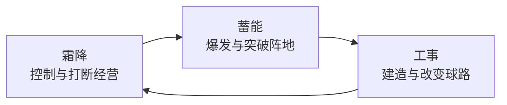
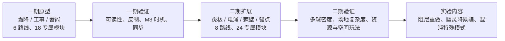

# Gatebreaker Arena 英雄系统设计 v0.5

> **版本**：v0.5  
> **日期**：2026-07-11  
> **状态**：重构方案，待一期原型验证  
> **前置版本**：[英雄系统设计 v0.4](Gatebreaker%20Arena%20英雄系统设计%20v0.4.md)

---

## 0. 版本目标

v0.3 定义了 10 名改装机、30 条路径、90 张专属模块的完整框架，但首发内容量和规则复杂度过高：多路径混装会稀释角色定位，品级同时决定数值、质变与里程碑速度，且时间、隐身、量子等机制对竞技可读性和联网同步风险较高。

v0.5 的原则是：**先验证三种不可替代的战斗体验，再扩充英雄数量。**

一期只交付可预测、可观察、可反制的机制；二期在一期数据稳定后，引入多球、资源消耗与空间操控；高风险规则改写内容暂不作为常规 PvP 英雄上线。

### 0.1 核心决策

| 项目 | v0.3 | v0.5 |
|---|---|---|
| 一期英雄 | 计划先实现 3 名、但完整设计覆盖 10 名 | 固定 3 名，作为正式首发范围 |
| 一期路径 | 每英雄 3 条 | 每英雄 2 条，共 6 条 |
| 一期专属模块 | 90 张总体设计 | 12 张（3 英雄 × 2 路径 × 2 个侧向变体）；第 3 方向后置 |
| 对局路线 | 可同时装备不同路径专属模块 | 对局前锁定 1 条主路线 |
| 核心体验 | 模块与多路径组合 | 英雄机制 + 单一路线极化 |
| 高风险机制 | 纳入常规英雄 | 暂缓、重做或改为特殊模式 |

### 0.2 一期体验支柱

| 英雄 | 体验支柱 | 玩家一句话理解 |
|---|---|---|
| 「霜降」 | 状态控制 | 叠低温、冻结对手，或把低温储成反击动能。 |
| 「工事」 | 场地建造 | 在正确位置建墙，并把墙变成防线或炮台。 |
| 「蓄能」 | 资源爆发 | 经营蓄能层数，在正确时机兑现爆发或持续增益。 |

---

## 1. 一期英雄与路线

### 1.1 「霜降」：低温状态管理

**核心资源**：低温。低温必须有清晰的累积、阈值、冻结和衰减提示。

| 路线 | 类别 | 定位 | 核心循环 | M2 方向 | M3 方向 | 设计边界 |
|---|---|---|---|---|---|---|
| 极寒之路 | 攻+守 | 冻结压制 | 累积低温 → 冻结敌方 → 制造防守窗口 | 冻结时额外降低敌方挡板移速 | 冻结扩大为短时强控制，并延长冷却过载窗口 | 不生成长期地面区域；不强化己方连续叠速。 |
| 冰晶之路 | 守+速 | 储冷反击 | 保存低温 → 等待回合 → 碰敌方挡板转化为己方加速 | 低温不衰减，首次碰板获得加速 | 连续碰板可叠加加速，设明确上限 | 不做即时群体减速；前期成长应慢于「炎核」涅槃。 |

**路线差异**：极寒控制的是**对手的操作能力**；冰晶经营的是**己方的反击动能**。

### 1.1a 低温追踪模型

低温是霜降的核心资源，其归属规则必须在实现前确定。一期统一采用**球模型**：

| 规则 | 说明 |
|---|---|
| **低温载体** | 低温层数附着在球上，不是挡板上的独立状态条。 |
| **累积方式** | 球碰敌方挡板时，该球低温层数 +1（基础每层 15 低温值）。 |
| **触发冻结** | 球的低温值 ≥ 100 时，碰挡板的瞬间触发冻结——冻结该挡板 1.5s，同时球的低温值归零。 |
| **低温衰减** | 球上的低温值每秒自然衰减 5，最低降至 0。球碰墙/碰屏障不衰减。 |
| **低温传递** | 低温不跨球传递；每颗球独立追踪自己的低温层数。 |
| **归属不变** | 低温层数不影响球的归属方（谁发的球仍是谁的球）。 |

**低温结算顺序与路线覆盖**：

1. 球碰敌方挡板时，先按当前路线规则尝试累积低温。
2. 低温值未满 100 时，结算结束。
3. 低温值达到或超过 100 时，由主路线决定结果；同一次碰撞只结算一种结果。

| 主路线 | 满 100 低温时的结果 | 消耗与限制 |
|---|---|---|
| 极寒之路 | 冻结被命中的敌方挡板 1.5s。 | 消耗 100 低温；同一挡板 6s 内再次触发时改为 50% 移速减速 1.5s，不再造成完整冻结。 |
| 冰晶之路 | 不触发冻结；该球获得 +25% 球速，持续 3s。 | 消耗 100 低温；同一球最多叠加 2 层，加速总上限 +50%。 |

低温基础参数（每次命中 +15、每秒衰减 5）仅作为原型起点。首轮测试需验证常规攻防下，极寒在 **8~12s** 内形成一次可被察觉的冻结威胁；未达到该窗口时优先调整累积与衰减，而不是延长冻结时长。

球模型的优势：
- **冰晶之路适配**：低温作为球的属性，"保存低温→转化"逻辑自然——球本身就是低温载体，碰敌方挡板时低温归零并转化为己方加速，无需额外机制。
- **工事克制适配**：屏障碰球时直接减少球上的低温层数，无需引入"挡板低温值"的新概念。
- **可读性**：玩家看到带低温的球，就能预判"这颗球快冻我了"——信息集中在球上，而非分散在挡板状态条上。

### 1.2 「工事」：场地几何建造

**核心资源**：屏障部署。屏障位置、长度、持续时间及碰撞反馈必须在场上可见。

| 路线 | 类别 | 定位 | 核心循环 | M2 方向 | M3 方向 | 设计边界 |
|---|---|---|---|---|---|---|
| 堡垒之路 | 攻+守 | 定向防线 | 观察敌球密度 → 部署屏障 → 压缩对手可用空间 | 屏障优先生成在敌球密集区 | 多面屏障自动连接为短时墙链 | 屏障只负责阻挡和导流，不承担随机偏转。 |
| 炮台之路 | 攻+速 | 借墙反攻 | 预判敌球路径 → 用屏障反弹 → 将球导向敌门 | 敌球碰屏障获得偏向敌门的速度增益 | 屏障周期性发射低频电弧脉冲 | 不扩张为长期铁壁；反攻强度受屏障数量和冷却约束。 |

**电弧脉冲参数**（炮台之路 M3 专属子机制）：

电弧脉冲是纯骚扰投射物，不是球：它不参与球物理、不进球、不反弹，也不增加场上球数。

| 参数 | 值 | 说明 |
|---|---|---|
| 发射间隔 | 全场共享 3s 冷却 | 任一炮台屏障可在冷却结束时发射；避免墙链按屏障数量倍增压制。 |
| 预警与方向 | 0.4s 地面预警，指向最近敌方挡板 | 玩家可通过移动躲开；预警结束后沿直线发射。 |
| 飞行与寿命 | 飞行 0.8s 后消失 | 穿过墙体与球，不产生碰撞、反弹或得分。 |
| 命中挡板 | 命中敌方挡板：移速 -20%，持续 1.5s | 命中后立即消失；命中己方挡板或球时无效果并消失。 |
| 屏障共存 | 屏障在发射脉冲后继续存在 | 屏障不因发射而消耗；脉冲由全场共享冷却限制。 |

**路线差异**：堡垒的目标是**减少失误空间**；炮台的目标是**制造可规划的反击角度**。

### 1.3 「蓄能」：资源经营与兑现

**核心资源**：蓄能层数。蓄能来源、当前层数、爆发阈值和消耗结果都必须对双方清晰可见。

| 路线 | 类别 | 定位 | 核心循环 | M2 方向 | M3 方向 | 设计边界 |
|---|---|---|---|---|---|---|
| 充能之路 | 攻+守 | 一次性爆发 | 累积层数 → 选择爆发时机 → 短时多球高压 | 爆发球分裂为 2 颗（存活 3s） | 爆发球分裂为 3 颗（存活 3s），并提供短时护盾/控制回报 | 不提供长时间常驻球速；爆发后应有明显真空期。分裂球有存活时间限制，与二期「混沌」的永久分裂球明确区分。 |
| 光芒之路 | 攻+速 | 常驻经营 | 累积层数 → 每层获得限时增益 → 持续反弹维持增益 | 每层提供己方球速增益（持续 5s） | 每层同时强化球速与挡板（持续 5s），并在爆发后产生短时全局加速 | 不做冻结与敌方标记，避免侵占「霜降」的控制空间。增益有时间窗口，防止终局滚雪球碾压。 |

**充能分裂球存活规则**：

充能的分裂球是"高压窗口"而非"多球增殖常态"。分裂球有存活时间限制，确保蓄能的核心体验仍然是"单球爆发"。

| 规则 | 说明 |
|---|---|
| **根球与存活时间** | 爆发前的球为根球，始终正常存在；临时复制体存活 3s 后消失。根球不会因复制体消失而重生或重置。 |
| **分裂球归属** | 临时复制体与根球同属蓄能方，可正常进球得分。任一球进门均按全局进球规则结算一次得分并重置该轮球状态。 |
| **分裂球碰撞** | 分裂球遵循正常球的碰撞规则（碰墙反弹、碰挡板反弹、碰门得分/反弹）。 |
| **3s 窗口体验** | 3s 内蓄能方有 2~3 颗球同时压向敌方——这是短暂的高压爆发，不是持续的球数优势。 |
| **与混沌区分** | 二期「混沌」的复制协议产生永久分裂球（球速×0.8），是完全不同的"多球增殖"体验。蓄能的分裂球是限时爆发，混沌的是常态增殖。 |

**光芒增益衰减规则**：

光芒路线的核心体验是"持续经营的节奏感"——不是永久的滚雪球，而是需要持续反弹才能维持的限时增益。

| 规则 | 说明 |
|---|---|
| **增益持续时间** | 每层增益持续 5s，到期后该层增益消失。 |
| **叠加逻辑** | 多层增益独立计时；第 1 层在第 5s 消失时，第 2 层可能才到第 3s——层数在波动，不是单调递增。 |
| **维持循环** | 玩家需要持续反弹来补充新层，维持增益在高位；停止反弹则增益自然回落。 |
| **体验目标** | 经营感："我得继续防守才能维持 buff"；终局不会碾压对手，因为增益是动态平衡而非永久积累。 |
| **层数上限** | 最多 3 层；第 1/2/3 层分别提供基础效果的 100% / 75% / 50%，所有层的总球速增益不得超过 +40%。 |

**路线差异**：充能是**攒满后兑现**；光芒是**每层立即获益、持续经营维持**。

### 1.3a 路线修改规则

路线选择**不改变被动模块的名称和触发条件**，但可以修改其参数和触发后的结果行为。被动模块的输入不变，输出根据路线重定义。

| 维度 | 不变 | 可变 |
|---|---|---|
| **名称** | 被动模块名称不变（霜降仍是"冷冻涂层"，工事仍是"自动屏障"） | — |
| **触发条件** | 触发时机不变（碰挡板累积低温、进球触发屏障等） | — |
| **参数** | — | 累积速率、衰减速度、触发阈值 |
| **结果行为** | — | 触发后的效果（冻结 vs 加速转化；反弹方向 vs 电弧发射） |

举例：霜降的冷冻涂层，在极寒之路中低温累积后触发冻结敌方挡板；在冰晶之路中低温不衰减、累积到阈值后转化为己方球速加速——触发条件相同（球碰敌方挡板累积低温），但结果行为由路线定义。

### 1.4 一期英雄软克制关系

一期采用可被操作和构筑改变的**软克制**，不采用“某英雄完全免疫另一英雄核心机制”的硬克制。目标是让英雄选择影响对局计划，而不是在选人阶段决定胜负。



| 对局倾向 | 克制原因 | 具体补强 | 边界与反制 |
|---|---|---|---|
| 霜降 → 蓄能 | 冻结和挡板减速压缩蓄能的安全经营、爆发准备空间。 | 当霜降的低温球碰蓄能方挡板并触发冻结时，**暂停蓄能获取 1s**；不会清空既有蓄能层数。 | 蓄能的能量护盾生效期间，低温球碰蓄能挡板时**不能获得新的低温层数**，但保留球上既有低温；护盾结束后低温恢复正常累积。护盾不额外提供冻结抵消，霜降仍可围绕已有高低温球创造后续威胁。 |
| 蓄能 → 工事 | 充能的多球爆发与光芒的高层加速，可针对屏障轮换和墙链空档施压。 | 充能爆发期间，临时复制体对同一面屏障的命中独立计数；**敌方有效球在 1.5s 内命中同一屏障 3 次**时，该屏障进入 1s 失效态后消散，计数窗口到期即清空。 | 屏障不被直接穿透；工事可通过合理部署分散压力，并以炮台反弹惩罚过度集中的球群。 |
| 工事 → 霜降 | 屏障提供额外接球点并改写球路，降低霜降稳定连续命中、累积低温的机会。 | 敌方球命中堡垒屏障时，该球的低温层数**减少 1 层**，最低降至 0；炮台屏障则使球产生固定角度反弹，优先打断直线连击。 | 屏障只减弱“命中该屏障的单颗球”的低温，不影响其他球，也不免疫冻结；霜降可用冰晶路线的蓄势反击绕开屏障。 |

**禁止项**：

- 工事不得获得冻结免疫、低温全局清除或自动拆除冰冻效果。
- 蓄能不得通过护盾永久免疫冻结；护盾仅在生效期间阻止新的低温层数，护盾结束后冻结风险恢复正常。
- 霜降不得冻结、删除或永久禁用工事屏障。
- 上述关系仅调整核心循环的效率，不直接修改伤害、得分或胜负判定。

---

## 2. 一期路线专属模块结构

### 2.1 内容规模

| 英雄 | 路线 | 积累 / 稳定变体 | 兑现 / 风格变体 | 合计 |
|---|---|---:|---:|---:|
| 霜降 | 极寒、冰晶 | 2 | 2 | 4 |
| 工事 | 堡垒、炮台 | 2 | 2 | 4 |
| 蓄能 | 充能、光芒 | 2 | 2 | 4 |
| **总计** | **6 条路线** | **6** | **6** | **12** |

每条路线的第 3 个侧向方向保留为后续候选内容；一期先验证两种明确风格是否已经足以形成有意义的构筑选择。

### 2.2 侧向变体职责

路线专属模块不再使用精铸 / 调校 / 至高的线性品级。每条路线的两个变体均提供相同的 +3 适配值，M1/M2/M3 的达成速度完全由匹配通用模块数量与时间门槛决定。

| 变体 | 适配值 | 内容职责 | 平衡要求 |
|---|---:|---|---|
| 积累 / 稳定型 | +3 | 更可靠地建立、保存或维持英雄核心资源。 | 单次兑现或爆发收益较低。 |
| 兑现 / 风格型 | +3 | 强化资源转化、主动窗口或路线的特色表现。 | 在积累效率、持续时间、容错或冷却上付出明确代价。 |

两个变体必须是等强的侧向选择，而非“高阶变体必然更强”。一期原型与早期 PvP 使用全解锁/官方租借池；收集与外观商业化不得影响适配值或 M3 达成速度。

### 2.3 专属模块的实现模板

每条路线只允许一个固定核心机制、一个固定 M2 转折和一个固定 M3 终局。专属模块变体只调整该路线的局部参数、资源循环或附带取舍，不能替换 M2/M3 的核心机制。

```text
路线定义
├── 核心参数：累积速度、范围、时长、冷却、上限
├── M1：基础数值强化
├── M2：单一行为转折
└── M3：单一终局子机制

专属模块变体
├── 积累 / 稳定型：强化资源建立或防守容错
└── 兑现 / 风格型：强化转化窗口，并附带明确取舍
```

### 2.4 一期路线变体清单

| 英雄 / 路线 | 积累 / 稳定变体 | 兑现 / 风格变体 | 与通用芯片的典型组合 |
|---|---|---|---|
| 霜降·极寒 | **寒霜之触**：提高低温建立效率，冻结附加收益较低。 | **冰封领域**：强化冻结后的减速压制，但低温建立效率较低。 | 前者偏长板/弹性墙；后者偏蓄能击/折射瞄准。 |
| 霜降·冰晶 | **霜化初成**：降低低温流失，提高稳定转化率。 | **霜化棱镜**：转化后的球速更高，但加速窗口更短。 | 前者偏长板/紧急制动；后者偏疾驰/速射/重发球。 |
| 工事·堡垒 | **工事基座**：提高屏障覆盖和持续，部署方向性较弱。 | **定向工事**：更精准地封锁敌球密集区，但屏障容错较低。 | 前者偏收缩门/弹性墙；后者偏疾驰/折射瞄准。 |
| 工事·炮台 | **炮台校准**：提高反弹导向的稳定性，反攻峰值较低。 | **反击炮台**：提高反攻球的威胁，但牺牲屏障频率或持续。 | 前者偏长板/紧急制动；后者偏重发球/过载。 |
| 蓄能·充能 | **微光储能**：更快积累蓄能，爆发规模较低。 | **蓄能审判**：爆发与护盾回报更高，但蓄能门槛更高。 | 前者偏快装填/弹药库；后者偏疾驰/重发球。 |
| 蓄能·光芒 | **光芒初绽**：增益更易维持，单层峰值较低。 | **蓄能光环**：高层增益更强，但衰减更快。 | 前者偏长板/快装填；后者偏疾驰/速射/过载。 |

所有变体均提供 +3 适配值。表中的取舍必须在数值原型中落实为可观察的参数差异，不能只写为风味文案。

一期 12 张路线变体的完整参数、上限与解锁归属，以[芯片清单与版本管理 v0.1](Gatebreaker%20Arena%20芯片清单与版本管理%20v0.1.md)为唯一数值来源。

---

## 3. 一期配装、激活与里程碑规则

### 3.1 配装规则

| 规则 | 一期值 | 说明 |
|---|---:|---|
| 改装方案上限 | 6 张 | 一期收缩为更易理解的构筑规模。 |
| 主路线专属模块 | 1 张，必选 | 对局前选择路线；只有主路线专属模块可进入方案。 |
| 通用模块 | 5 张 | 留出 4 张匹配位达成 M3 与 1 张功能自由位。 |
| 同名模块 | 不可重复 | 保持不变。 |
| 通用类别上限 | 每类最多 3 张 | 保持不变。 |
| 路线专属模块 | 1 张 | 每局只存在当前主路线的 1 张侧向变体。 |

一期**禁止不同路径专属模块混装**。这样可以避免攻类或守类通用模块同时推进多个分支、导致双 M3 或三路线混合而失去角色辨识度。

### 3.2 激活规则

| 时间点 | 激活内容 | 规则 |
|---|---|---|
| t=0 | 主路线专属模块 + 2 张初选通用模块 | 玩家赛前指定两张开局通用模块，其中至少 1 张必须匹配主路线；保证核心循环开局可用。 |
| t=15s | 1 张通用模块 | 第一次中盘强化。 |
| t=30s | 1 张通用模块 | 推动 M2 或补足路线适配。 |
| t=45s | 1 张终盘通用模块 | 激活完整 6 张方案，并允许触发 M3。 |

一期不使用隐藏随机抽取。玩家赛前指定两张初选通用模块，并为剩余三张设置或查看 15s / 30s / 45s 的激活顺序。玩家若在 5 张通用模块中配置至少 4 张主路线匹配模块，即可在 t=45s 后稳定满足 M3 条件；剩余 1 张可用于功能性选择。

### 3.3 里程碑

| 里程碑 | 条件 | 作用 |
|---|---|---|
| M1 激活 | 主专属 + 1 张匹配通用模块 | 核心循环成型。 |
| M2 质变 | 主专属 + 2 张匹配通用模块 | 触发路线的单一行为转折。 |
| M3 极化 | 主专属 + 4 张匹配通用模块，且时间不早于 t=45s | 触发终局子机制。 |

该设计将 M3 锁定在终盘，避免专属变体让开局直接极化；同时让玩家通过通用模块类别选择表达构筑策略。

---

## 4. 二期英雄规划

二期以前置一期的可读性、对局节奏、模块触发率和反制数据为准入条件。满足后再引入以下 4 名英雄，每名先实现 2 条路线。

| 英雄 | 优先路线 | 新玩法 | 与一期的差异 |
|---|---|---|---|
| 「炎核」 | 涅槃、焦土 | 连击加速；敌方半场区域封锁 | 不是低温控制，而是主动进攻与封路。 |
| 「电涌」 | 雷霆、雷电 | 多球链式联动；短窗口全场齐射 | 强调球与球之间的关系，而非状态条或建造。 |
| 「棘壁」 | 荆棘、生长 | 敌方资源消耗；挡板本体成长 | 以接触惩罚和本体变化建立防线。 |
| 「锚点」 | 引力炮、扭曲 | 弹射点规划；连续曲线路径 | 以空间几何和路线规划取胜。 |

### 4.1 二期路线边界

| 路线 | 必须突出 | 不应包含 |
|---|---|---|
| 炎核·涅槃 | 碰敌方挡板的短期连击叠速 | 永久蓄层或大范围控速。 |
| 炎核·焦土 | 可见、固定、可绕开的敌方半场封锁区 | 隐身、随机偏转或实体墙。 |
| 电涌·雷霆 | 多球链式目标选择 | 长时间地面区域。 |
| 电涌·雷电 | 短时全场高速齐射 | 永久多球增殖。 |
| 棘壁·荆棘 | 碰撞反伤与敌方弹药消耗 | 大幅球速加成。 |
| 棘壁·生长 | 挡板本体成长 | 独立建筑部署。 |
| 锚点·引力炮 | 固定弹射点与路线规划 | 碰板叠速。 |
| 锚点·扭曲 | 连续弯曲轨迹 | 随机时间跳跃；瞬移需另行实验。 |

二期基础规模为 4 英雄 × 2 路线 × 2 个变体 = **16 张专属模块**；加上一期共 28 张。各路线的第 3 方向仅在一期/二期数据验证后按需补充。

---

## 5. 暂缓、重做与去留

### 5.1 暂缓英雄

| 当前英雄 | 结论 | 原因 | 后续方向 |
|---|---|---|---|
| 「阻尼」 | 暂缓 | 时间前跳、回退、回溯和冻结会破坏预判，并提高同步与回放风险。 | 重做为“节奏场”英雄：只调整明确的速度窗口，不修改真实时间轴。 |
| 「幽灵」 | 暂缓 | 完全隐身、残影偏移和视觉/碰撞位置不一致，伤害竞技公平与观战可读性。 | 保留可见的暗影轨迹陷阱；删除真实碰撞欺骗和完全隐身。 |
| 「混沌」 | 不作为常规 PvP 英雄 | 隧穿、长期叠加态、多球复制和全场概率事件属于规则级改写。 | 改为赛季特殊模式、PVE 首领或场地异常。 |

### 5.2 后置路线

| 路线 | 后置理由 |
|---|---|
| 炎核·炼狱 | 与极寒同属持续状态削弱，优先级低于涅槃和焦土。 |
| 电涌·电磁 | 与迷阵、暗影网同为场地区域干扰，待场地可读性验证后再做。 |
| 棘壁·腐化 | 传播链、发球变体和全场减速的组合复杂，先验证资源惩罚是否成立。 |
| 锚点·深渊 | 与霜降、阻尼共享减速控制空间，缺乏首发必要性。 |
| 霜降·冰暴 | 作为极寒的后续扩展或活动分支，避免一期同时存在多种群体减速。 |
| 蓄能·照耀 | 标记、减速、净化会跨入控制与反隐职责，后置。 |
| 工事·迷阵 | 随机偏转与移动屏障应在基础建筑玩法稳定后再验证。 |

---

## 6. 平衡与可读性红线

| 红线 | 一期规则 |
|---|---|
| M3 时机 | 不早于 t=45s。 |
| 同时有效主路线 | 仅 1 条。 |
| 无预警硬控 | 禁止；冻结、屏障、爆发阈值必须有清晰前摇或 UI 提示。 |
| 完全不可见的致命球 | 禁止。 |
| 视觉位置与真实碰撞位置不一致 | 禁止。 |
| 无法预判的真实瞬移/回溯 | 禁止。 |
| 英雄克制 | 只能削弱对方核心循环效率；禁止完全免疫、直接删除资源或直接破坏建筑。 |
| 硬控连续命中 | 同一挡板 6s 内最多承受一次完整冻结；后续冻结改为短时减速。 |
| 自动生成的持续伤害/压制物 | 必须有上限、持续时间和明确边界。 |
| 多球数量 | 一期只允许「蓄能·充能」在短时爆发窗口制造额外球。 |
| 临时球状态继承 | 分裂、复制或新生成的球默认不继承低温、护盾、临时加速、追踪、穿透等状态；仅由具体规则显式授权继承。 |

### 6.1 一期验收指标

| 维度 | 验收问题 |
|---|---|
| 角色辨识 | 玩家能否在 10 秒内说出霜降、工事、蓄能各自的赢法？ |
| 路线辨识 | 同一英雄的两条路线能否在一次对局中被明显区分？ |
| 反制 | 每个 M2/M3 是否存在清楚、可操作、非唯一的反制方法？ |
| 克制闭环 | 霜降对蓄能、蓄能对工事、工事对霜降是否均为小优而非必胜？ |
| 状态交互 | 分裂球、屏障和护盾与低温、冻结、临时加速的结算是否符合“状态继承”红线？ |
| 节奏 | M2 是否主要出现在中盘，M3 是否主要出现在终盘？ |
| 随机性 | 玩家是否每局都能体验其选定路线，而非被抽取顺序否决？ |
| 性能与同步 | 屏障、分裂球、冻结和加速在网络回放中是否一致？ |

---

## 7. 上线路线图



---

## 8. 与 v0.3 的迁移清单

- [ ] 将 v0.3 的一期目标从“3 名英雄 + 9 条路径”改为“3 名英雄 + 6 条路径”。
- [ ] 从专属模块数据表中保留：霜降（极寒、冰晶）、工事（堡垒、炮台）、蓄能（充能、光芒）。
- [ ] 将一期专属模块总量收缩为 12 张侧向变体，并按参数化模板实现。
- [ ] 改装方案改为“1 专属 + 5 通用”；删除一期多路径专属混装。
- [ ] 修复通用模块上限与构筑示例不一致的问题。
- [ ] 将 M3 改为终盘门槛，不允许由路线专属变体在开局直接取得。
- [ ] 将阻尼、幽灵、混沌移出常规 PvP 英雄首发列表。
- [ ] 完成一期验证后，才创建二期 16 张路线专属变体的数据和实现任务，并评估是否补充一期第 3 方向。

---

## 变更日志

| 版本 | 日期 | 变更内容 |
|---|---|---|
| v0.5 | 2026-07-12 | 一期英雄设计审查后的修订：①新增低温追踪模型（球模型）与极寒/冰晶的阈值结算顺序；②护盾改为仅阻止新增低温层，不删除既有低温；③炮台 M3 改为全场共享冷却的电弧脉冲，不再生成额外球；④光芒路线改为 5s 衰减、3 层上限和总球速上限；⑤充能分裂球改为根球+临时复制体，并明确进球结算；⑥屏障承压补充 1.5s/3 次命中/1s 失效态；⑦一期方案收缩为 1 专属+5 通用，采用 0/15/30/45 秒四阶段激活，M2/M3 改为 2/4 张匹配通用芯片且 M3 于 45 秒开放；⑧新增冻结连续命中、临时球状态继承等平衡红线；⑨新增路线修改规则（路线不改变被动模块名称和触发条件，只修改参数和结果行为）；⑩路线专属芯片由 18 张线性品级改为 12 张等适配值侧向变体，并补齐完整数值表。 |
| v0.4 | 2026-07-11 | 一期范围重构：3 英雄 6 路线 18 专属模块；禁止跨路径混装；M3 锁定终盘；暂缓阻尼/幽灵/混沌。 |
